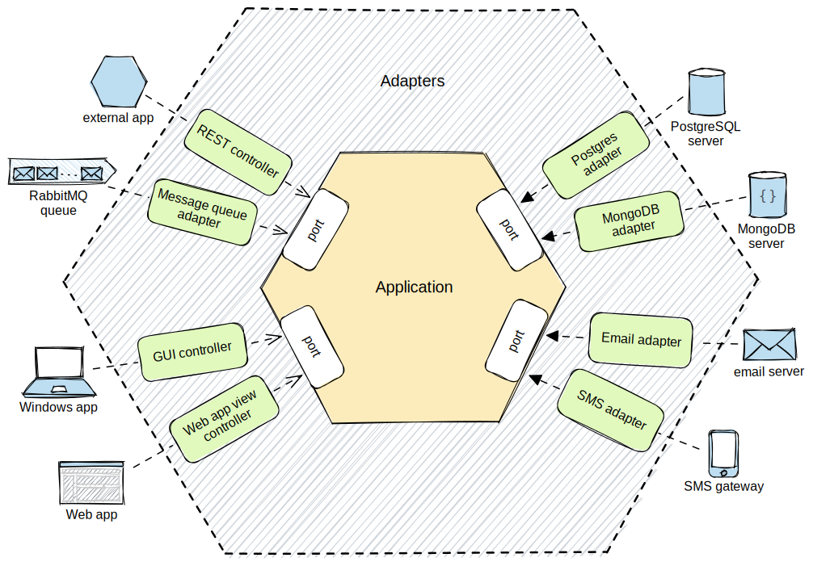

# Arquitetura hexagonal (portas e adaptadores)

Projeto para servir como template/exemplo de arquitetura hexagonal

## Princípios Fundamentais

1. **Inversão de Dependência:**
- A camada `domain` é o coração da aplicação, contendo a lógica e as entidades principais do negócio.
- NÃO depende de detalhes externos, como implementações de banco de dados ou estruturas de UI.
- Em vez disso, camadas externas (por exemplo, `integration` para acesso ao banco de dados, `delivery` para controladores REST) dependem de abstrações definidas dentro do `domain`.

2. **Portas como Interfaces:**
- “Portas” são interfaces definidas na camada `domain`. Eles atuam como contratos que especificam as operações que o domínio precisa para interagir com o mundo exterior.
- Exemplos: `ExecutaExemploServicePort`, que é uma interface utilizada para o controller poder chamar `service` da aplicação

3. **Adaptadores como implementações:**
- "Adaptadores" são classes localizadas na camada `integration`. Eles implementam as interfaces dentro da pasta `adapter` do `domain`.
-  Basicamente qualquer chamada/comunicação com serviço externo, produção evento, request, consulta no banco etc seria um `adapter`
-  Na teoria o adapter seria só a implementação, mas achei melhor deixar uma pasta separada dentro da `domain` chamada adapter ao inves de port porque senão pode ficar muito confuso dependendo da quantidade de "saída" da aplicação
-  Dessa forma port seriam como as entradas para o domain, enquanto o adapter as saídas para consultas

## Estrutura do Projeto

- `domain`: Lógica de negócios central (`service`), contem também as interfaces de portas e adaptadores.
- `integration`: Adaptadores para acesso a banco de dados, clientes API, etc.
- `delivery`: Entrada de dados, controladores REST, consumidores de fila de mensageria, etc.
- `application`: arquivos de configuração de @Bean, Banco de dados, kafka etc.

